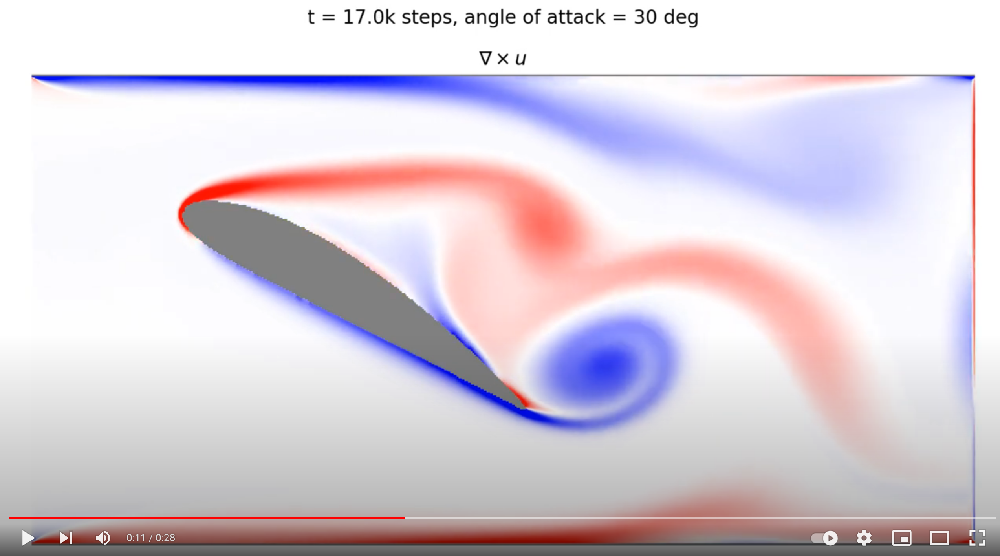

# Lattice Boltzmann Method
Python code for simulating 2D fluid dynamics using the lattice-boltzmann method.

**Features**
- Simulation of isothermal, 2D flows on a squared grid (2DQ9)
- Parallelized using jax.numpy: Runs on both CPUs or GPUs
- Geometry can simply be defined by loading a png bitmap

Example output of the simulation:
